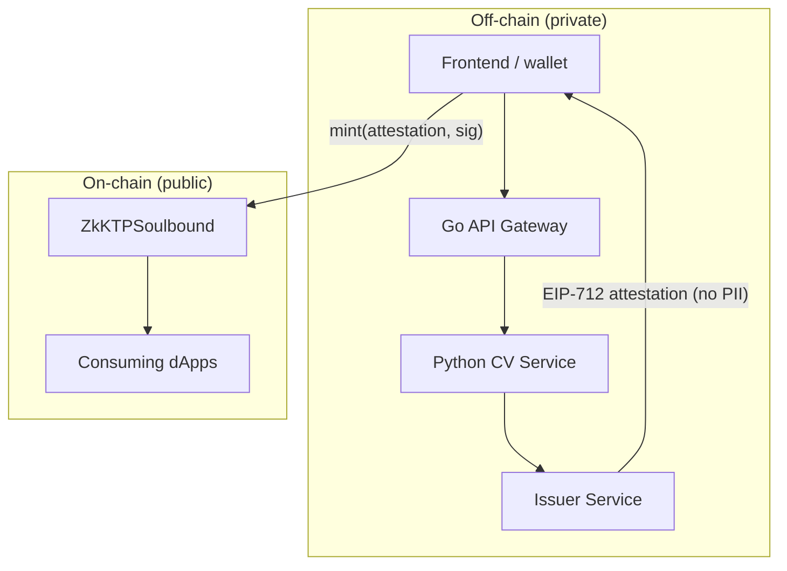

# zkKTP — Architecture

This document describes the technical design of zkKTP: how an Indonesian identity is verified off-chain, converted into a privacy-preserving on-chain credential, and consumed by dApps. It is written to be read by Web3-native reviewers, so it is explicit about the trust model, the threat model, and where zero-knowledge does and does not apply.

## 1. Design goals

1. **No PII on-chain.** The KTP, NIK, and biometric data must never be written to a public ledger.
2. **No custodial honeypot.** Raw identity documents are destroyed immediately after verification; the system holds no reusable identity database.
3. **One human, one credential.** A single verified person cannot mint multiple credentials to farm Sybil rewards.
4. **Non-transferable.** The credential is bound to the holder and cannot be sold or moved (soulbound).
5. **Permissionless consumption.** Any dApp can verify a credential on-chain with a single read call, no integration with the issuer required.

## 2. System overview

zkKTP is split into a private off-chain plane and a public on-chain plane, bridged by a signed attestation that carries no PII.



## 3. Off-chain verification plane

This plane is forked from a production KYC pipeline and is already working. Its job ends at a binary decision plus a nullifier commitment.

### 3.1 Go API Gateway
- Terminates client requests, enforces JWT auth and per-IP / per-wallet rate limiting.
- Orchestrates the verification call and, on success, the issuer call.
- Never persists image payloads; streams them to the CV service and drops them.

### 3.2 Python CV Service (FastAPI)
Pipeline stages, each a hard gate:
1. **Image-quality gate** — rejects blur, glare, low resolution, and cropping before any inference runs.
2. **KTP OCR** — Tesseract-based extraction of NIK, name, DOB, and address, with regex/format validation of the NIK structure.
3. **Face detection + liveness** — detects the face on the KTP and on the selfie, runs a liveness check to reject spoofed photos, and confirms a match.
4. **Calibrated confidence gate** — a single decision threshold (calibrated, not raw model score) outputs `approve` or `escalate-to-human`. Nothing is auto-approved below the calibrated bound; ambiguous cases route to manual review rather than failing open.

Output: `{ decision, nik_commitment }`. The raw NIK never leaves this service in cleartext beyond the commitment step.

### 3.3 Issuer Service (new)
- Computes the **nullifier**: `nullifier = H(normalize(NIK))`, a one-way commitment. Same person ⇒ same nullifier ⇒ double-mint is rejected on-chain. The NIK cannot be recovered from the nullifier.
- Signs an **EIP-712 attestation** (see §5) binding the requesting wallet to the nullifier with an expiry.
- **Destroys the raw documents and the cleartext NIK.** Retains, at most, the nullifier for its own duplicate-detection — never the underlying identity.

## 4. On-chain credential plane

### 4.1 `ZkKTPSoulbound` contract
An ERC-721 token that implements **ERC-5192** (minimal soulbound) — every token is permanently `locked`, and all transfers revert.

Responsibilities:
- **Verify** the issuer's EIP-712 signature against a trusted issuer key.
- **Enforce uniqueness** via an on-chain `usedNullifiers` registry — a nullifier can mint exactly once.
- **Bind** the credential to `msg.sender` matching the attestation `subject`, so an intercepted attestation cannot be redeemed by a different wallet.
- **Expose** `isVerified(address)` and `locked(tokenId)` as public reads for dApps.

See [`contracts/ZkKTPSoulbound.sol`](./contracts/ZkKTPSoulbound.sol).

### 4.2 Consumption
A dApp gates an action with a single view call:
```solidity
require(zkKTP.isVerified(msg.sender), "not a verified unique human");
```
No coupling to the issuer, no PII, no per-dApp KYC integration.

## 5. Attestation format (EIP-712)

```
Attestation(
    address subject,     // wallet permitted to mint
    bytes32 nullifier,   // H(NIK) — uniqueness anchor, non-reversible
    uint256 expiry       // unix seconds; mint reverts after this
)
```
The contract reconstructs the typed-data hash, recovers the signer via ECDSA, and requires it to equal the configured `trustedIssuer`. Replay across wallets is prevented by the `subject == msg.sender` check; replay in time is prevented by `expiry`; replay of identity is prevented by `usedNullifiers`.

## 6. Trust and threat model

**What is trusted:** the issuer key correctly signs only genuinely verified subjects. This is the honest MVP assumption — a single trusted verifier, like most identity attestation systems at v1.

**What is NOT trusted with PII:** the chain (sees only nullifier + wallet), consuming dApps (see only a boolean), and any observer.

Threats and mitigations:
| Threat | Mitigation |
|---|---|
| Sybil / multi-mint by one person | `nullifier = H(NIK)` + on-chain `usedNullifiers` registry |
| Stolen attestation redeemed by attacker | `subject == msg.sender` binding |
| Replayed old attestation | `expiry` field |
| Credential resale / transfer | ERC-5192 soulbound; transfers revert |
| PII exposure on-chain | Only nullifier leaves the enclave; raw docs destroyed |
| Compromised issuer key | Key rotation via owner; **removed by the zk upgrade in §7** |

## 7. Zero-knowledge upgrade path (differentiator)

The MVP trusts the issuer not to *link* a wallet to an identity at sign time (it technically could, since it sees both). The zk upgrade removes even that.

Adopt a **Semaphore-style** design:
1. At verification, the issuer inserts the user's **identity commitment** into a Merkle group of verified humans — without recording which wallet it belongs to.
2. Later, from any wallet, the user generates a **zk proof of membership** in that group plus a fresh **nullifier**, revealing neither the commitment nor which leaf.
3. The contract verifies the proof and rejects reused nullifiers.

Result: the issuer knows *that* someone was verified but cannot link *which wallet* later claims the credential. Verification and minting are cryptographically decoupled. This is the stretch goal; the Merkle/nullifier scaffolding is designed so the MVP contract can be swapped for a verifier-backed one without changing the off-chain plane.

## 8. Deployment

- **Testnet:** Lisk Sepolia (chosen for its active Indonesian Web3 community and theme fit) or Base Sepolia as a fallback.
- **Contracts:** Foundry for build, test, and deploy; OpenZeppelin for ERC-721 / EIP-712 / ECDSA primitives.
- **Off-chain services:** containerized (Docker Compose) exactly as in the source pipeline; no new custody surface is introduced.
