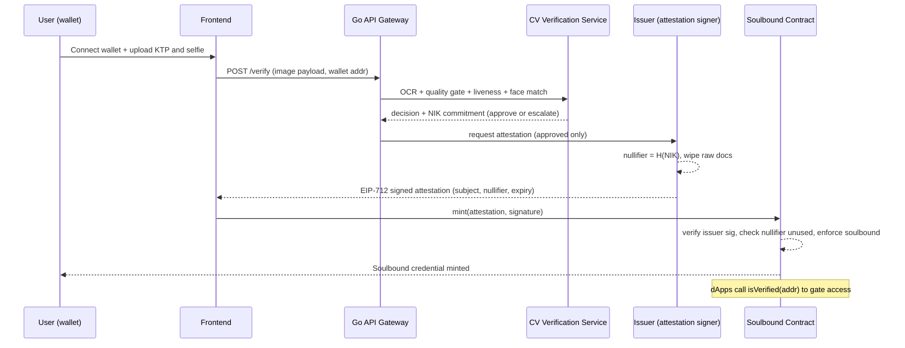

# zkKTP — Proof-of-Personhood for Indonesia

**Prove you are a real, unique Indonesian human on-chain — without your national ID (KTP) or biometrics ever touching a blockchain or a custodial server.**

> Verify off-chain. Mint a soulbound credential. No KTP, NIK, or biometric ever touches the chain — zero-knowledge issuance is the roadmap.


---

## Live on Lisk Sepolia

The on-chain credential layer is deployed, verified, and minting — not a mock.

- **Contract (verified):** [`0xe15BcdB80cf2ba96fDAf43b69f18Eb1f586a8b4d`](https://sepolia-blockscout.lisk.com/address/0xe15bcdb80cf2ba96fdaf43b69f18eb1f586a8b4d)
- **First credential:** [soulbound token #1](https://sepolia-blockscout.lisk.com/tx/0xe863C118E1E329DF4F68cC6560F4dC11D0951A2f) — minted, non-transferable, `isVerified` returns `true`
- **Trusted issuer:** `0x2f4c…F54C`
- **Live app:** [zkktp-app.vercel.app](https://zkktp-app.vercel.app) — connect a wallet, mint your credential
- **Contracts:** ERC-5192 soulbound + EIP-712 attestation · 12/12 tests passing

---

## The problem

On-chain services cannot tell a real, unique human from a bot or a Sybil farm. The industry's answer — KYC — solves it by centralizing users' identity documents into custodial honeypots, which is the exact opposite of Web3's trust model. KTP data leaks are already endemic in Indonesia, so "just trust the KYC vendor" is not a safe default.

Indonesia has some of the highest retail crypto adoption in the region, yet there is **no privacy-preserving way to prove you are a unique, verified Indonesian human on-chain** without doxxing your KTP to a third party.

## Why it matters

- **Sybil resistance** — airdrop farming and one-wallet-per-thousand governance attacks drain protocols and distort DAO votes.
- **Compliant DeFi** — regulated on-chain finance is impossible without a verifiable identity signal.
- **No honeypots** — every centralized KYC provider is a breach waiting to happen.

Solving proof-of-personhood *without custody of PII* unlocks Sybil-resistant token distribution, one-person-one-vote governance, and regulator-friendly on-chain finance for 270M+ Indonesians — a market no global identity protocol (Worldcoin, Polygon ID) has localized to the KTP.

## What it does

zkKTP verifies a real Indonesian identity **off-chain**, then issues a **non-transferable soulbound credential** to the user's wallet proving *"unique, verified human"* — while the KTP and biometric data are destroyed after verification. Only a **nullifier** (a one-way commitment derived from the NIK) and a signed attestation ever leave the verification service — never the KTP, the selfie, or the NIK in the clear. Any dApp can then read the credential on-chain to gate access.

*(The MVP binds the credential with an issuer-signed EIP-712 attestation; a zero-knowledge circuit that additionally unlinks the wallet from the identity at mint time is the roadmap upgrade — see [Project status](#project-status).)*

One human → one credential. No document custody. No wallet-to-identity link on-chain.

## How it works



1. **Connect + submit.** The user connects their wallet and uploads a KTP photo and a selfie.
2. **Verify off-chain.** A Go API gateway orchestrates a Python computer-vision service: OCR extracts and validates the NIK and fields, an image-quality gate rejects blur/glare, and face detection + liveness confirms a live person matching the document. A **calibrated confidence gate** returns `approve` or `escalate-to-human`.
3. **Attest, then forget.** On approval, the issuer computes `nullifier = H(NIK)`, signs an EIP-712 attestation binding the wallet to that nullifier, and **destroys the raw documents**. The NIK is never stored in the clear.
4. **Mint soulbound.** The user submits the attestation to the contract, which verifies the issuer signature, rejects any reused nullifier (one human = one credential), and mints a **non-transferable** token.
5. **Consume.** Any dApp calls `isVerified(address)` for Sybil-resistant airdrops, compliant onboarding, or governance.

## Architecture

Two halves, deliberately decoupled so identity data never reaches the chain.

```
┌────────────────────────── OFF-CHAIN (private) ──────────────────────────┐
│                                                                          │
│   Frontend ──▶ Go API Gateway ──▶ Python CV Service                      │
│   (wallet)     (JWT, rate-limit)   (OCR · quality gate · liveness ·      │
│                      │              face match · confidence gate)        │
│                      ▼                                                    │
│                 Issuer Service  ──▶  nullifier = H(NIK), sign EIP-712,    │
│                                       destroy raw PII                     │
└──────────────────────────────────┬───────────────────────────────────────┘
                                    │  signed attestation (no PII)
┌───────────────────────────────────▼──────────────── ON-CHAIN (public) ──┐
│   ZkKTPSoulbound (ERC-721 + ERC-5192)                                    │
│   mint() · verify issuer sig · nullifier registry · transfers revert     │
│   isVerified(addr) → dApps                                               │
└──────────────────────────────────────────────────────────────────────────┘
```

Full technical design, including the zero-knowledge upgrade path, is in **[ARCHITECTURE.md](./ARCHITECTURE.md)**.

## Tech stack

| Layer        | Stack                                                                |
| ------------ | -------------------------------------------------------------------- |
| Frontend     | Next.js · wagmi / viem · wallet connect                              |
| API Gateway  | Go 1.22 · JWT auth · rate limiting                                   |
| Verification | Python 3.11 · FastAPI · OpenCV · Tesseract OCR · YOLO face detection |
| Issuer       | EIP-712 typed-data signing · nullifier derivation                    |
| Contracts    | Solidity 0.8.24 · OpenZeppelin · ERC-5192 soulbound · Foundry        |
| Chain        | Lisk Sepolia testnet (strong Indonesian Web3 footprint)              |
| ZK (stretch) | Semaphore-style Merkle membership + nullifier circuit                |

## Project status

Honest state — the off-chain verification engine is production-grade, and the on-chain credential layer is now deployed, verified, and minting on Lisk Sepolia. The one piece still open is wiring the real KTP pipeline to the issuer signature (see the last row).

| Component                                        | Status                                                                                      |
| ------------------------------------------------ | ------------------------------------------------------------------------------------------- |
| Go API gateway (auth, rate-limit, orchestration) | ✅ Working                                                                                   |
| KTP OCR + NIK/field extraction & validation      | ✅ Working                                                                                   |
| Image-quality gate                               | ✅ Working                                                                                   |
| Face detection + liveness / selfie match         | ✅ Working                                                                                   |
| Calibrated approve / escalate confidence gate    | ✅ Working                                                                                   |
| `ZkKTPSoulbound` contract (ERC-5192)             | ✅ Deployed & verified on Lisk Sepolia                                                       |
| Contract test suite                              | ✅ 12/12 passing (Foundry)                                                                   |
| Nullifier + EIP-712 issuer signing               | ✅ Working (issuer service + `/api/attest`)                                                  |
| First on-chain mint                              | ✅ [Token #1 minted](https://sepolia-blockscout.lisk.com/tx/0xe863C118E1E329DF4F68cC6560F4dC11D0951A2f) |
| Wallet-connect frontend + mint flow              | ✅ Working — [live app](https://zkktp-app.vercel.app)                                        |
| Live KTP → issuer pipeline link (real verification, not demo) | 🔨 In progress — issuer currently signs on request                             |
| ZK membership circuit (unlink wallet ↔ identity) | 🎯 Stretch                                                                                   |

The off-chain half is forked from a prior production KYC pipeline. This project's contribution is the **on-chain credential layer** and the **PII-discard attestation bridge** that makes it Web3-native.

## Sprint roadmap

- **MVP (shipped):** EIP-712 attestation → soulbound mint → `isVerified` read, live and verified on Lisk Sepolia, demoable end-to-end via the web app.
- **Next:** wire the live KTP OCR + liveness pipeline to the issuer signature so verification is real, not simulated.
- **Differentiator:** replace direct attestation with a Semaphore-style zk membership proof so the issuer cannot link a wallet to an identity even at mint time.

## Repository structure

```
zkktp/
├── README.md
├── ARCHITECTURE.md
├── foundry.toml
├── contracts/
│   └── ZkKTPSoulbound.sol      # ERC-5192 soulbound credential + attestation verification
├── test/
│   └── ZkKTPSoulbound.t.sol    # 12-test Foundry suite
├── script/
│   ├── Deploy.s.sol            # deploy with trusted issuer
│   └── Mint.s.sol              # issuer-signed mint
├── services/
│   └── issuer/                 # nullifier + EIP-712 signer (Node/viem)
├── zkktp-app/                  # Next.js wallet-connect + mint frontend
├── circuits/                   # zk membership proof (stretch)
└── frontend/                   # (superseded by zkktp-app)
```

## License

MIT
